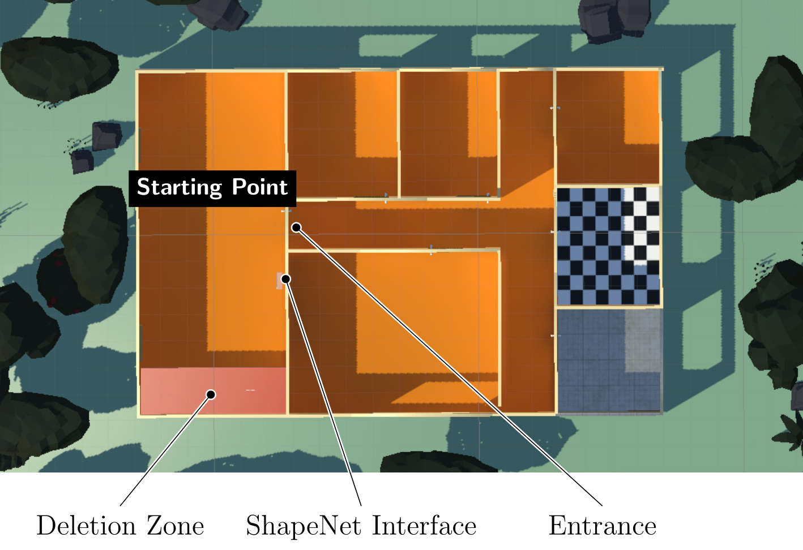
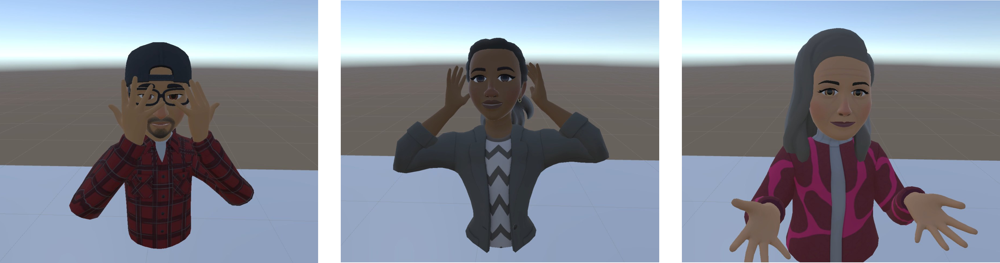

# How protean is VR experience? Measuring awareness of artificial restrictions in interaction-based applications

  

---

## Table of Contents

1. [Abstract](#1-abstract)  
2. [About this repository](#2-about-this-repository)
3. [Content](#3-content)

---

## 1. Abstract

We explore a previously unexamined variant of the Proteus effect -- the behavioral changes in human users resulting from the transfer of stereotypical traits associated with the visual appearance of an avatar to the human user controlling it -- in virtual reality (VR) applications.
Specifically, we investigate the influence of characteristics not linked to the visible appearance of an avatar but rather to its sensory abilities.
Our primary hypothesis is that these restrictions impact both self-perception and communication.
To evaluate this, we examine differences in participants’ linguistic, gestural, and spatial behavior, using natural language processing (NLP) methods.
Although the three restrictions led to significant behavioral differences -- in particular interaction restriction --, they did not affect the participants' task-related interactions or their evaluation of the VR application.
Participants compensate for the negative effects of the restrictions so that they do not noticeably affect interactions or attitudes toward the application. Even during explicit evaluation, participants refrained from criticizing their limitation and instead continued their compensatory behavior.
In short, there is no Proteus effect caused by artificial restrictions -- at least in the range of simulations considered here.

---

## 2. About this repository

This repository contains a collection of scripts and prompts used for data analysis in the accompanying research paper. 
These scripts were originally part of a larger project that included additional analyses not covered in the publication.

Please note:
The scripts are not designed to function out of the box, as the dataset cannot be publicly shared.
Some preprocessing or adjustments may be required to adapt them to other datasets or use cases.

For any questions or further inquiries, please contact the authors of the paper.

## 3. Content

* `data/` - Contains the figures used in this repository.
* `documents/` - Contains the questionaries and promts used in the study.
* `scripts/` - Contains the scripts used for data analysis.
